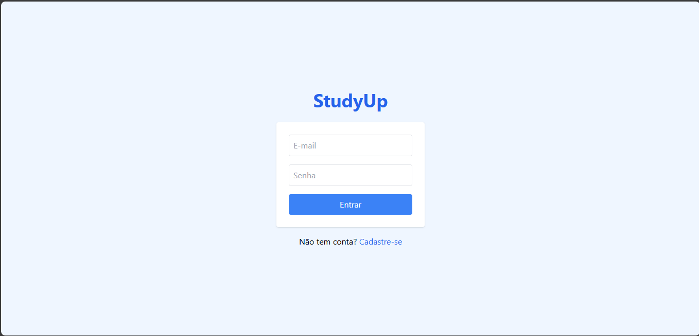

# 📚 StudyUp

> Um protótipo multiplataforma (web + mobile) para organização de estudos, desenvolvido como parte do projeto interdisciplinar de **Análise e Desenvolvimento de Sistemas**.

 <!-- opcional, você pode colocar uma imagem futuramente -->

---

## 🚀 Sobre o Projeto

O **StudyUp** é um aplicativo que ajuda estudantes a organizar suas atividades diárias, metas e prazos de forma simples e intuitiva.

Com ele, você pode:
- ✅ Cadastrar tarefas com título, data e horário  
- 📅 Visualizar todas as atividades na **Agenda**  
- 🎯 Definir metas de estudo e acompanhar o progresso  
- 🗑️ Gerenciar a **Lixeira** (restaurar ou apagar tarefas)  
- 🌍 Alternar entre idiomas **Português** e **Inglês**  
- 🎨 Trocar entre tema **claro** e **escuro**  

---

## 🖥️ Tecnologias Utilizadas

- [React](https://react.dev/)  
- [React Router](https://reactrouter.com/)  
- [TailwindCSS](https://tailwindcss.com/)  
- [Context API](https://react.dev/reference/react/useContext)  
- [LocalStorage](https://developer.mozilla.org/en-US/docs/Web/API/Window/localStorage)  

---

## 📂 Estrutura de Páginas

- **Login** – tela inicial de acesso  
- **Home** – visão das tarefas do dia  
- **Agenda** – lista completa de atividades  
- **Cadastro** – adicionar nova atividade  
- **Metas** – definição e acompanhamento de metas  
- **Lixeira** – restaurar ou apagar tarefas excluídas  
- **Ajuda** – explicação rápida e links do criador  
- **Configurações** – idioma e tema  

---

## ⚡ Como Rodar Localmente

1. Clone o repositório:
   ```bash
   git clone https://github.com/MoiRaibolt/studyup.git
   cd studyup

2. Instale as dependências:

npm install


3. Rode o projeto em modo dev:

npm run dev

4. Acesse em:
👉 http://localhost:3000

📦 Build de Produção

Para gerar a versão otimizada:

npm run build


Isso cria a pasta /build, pronta para deploy (Netlify, Vercel, GitHub Pages, etc).

🔗 Links Relacionados

📘 README do Electron
 – versão desktop com auto-update

🐙 GitHub: [github.com/SEU_USUARIO](https://github.com/MoiRaibolt)

📩 Contato: moisesraibolt@gmail.com

👨‍💻 Autor

Moisés Raibolt
Estudante de Análise e Desenvolvimento de Sistemas
